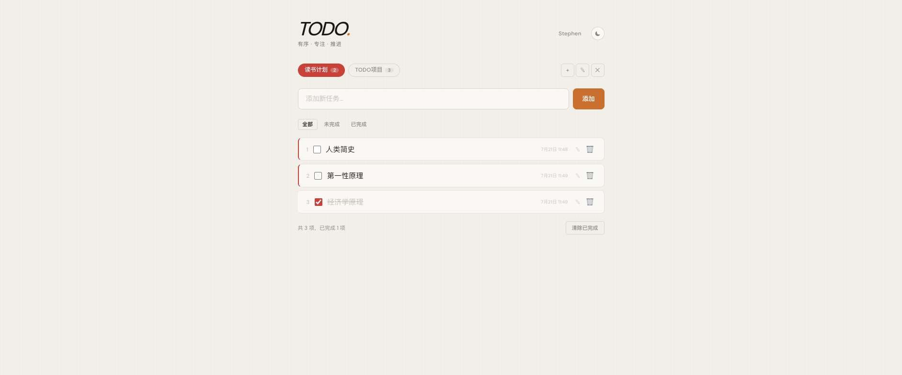
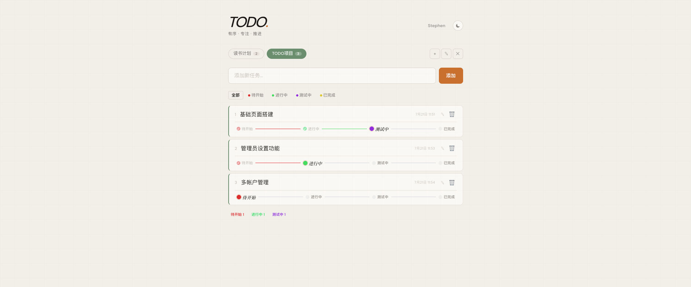
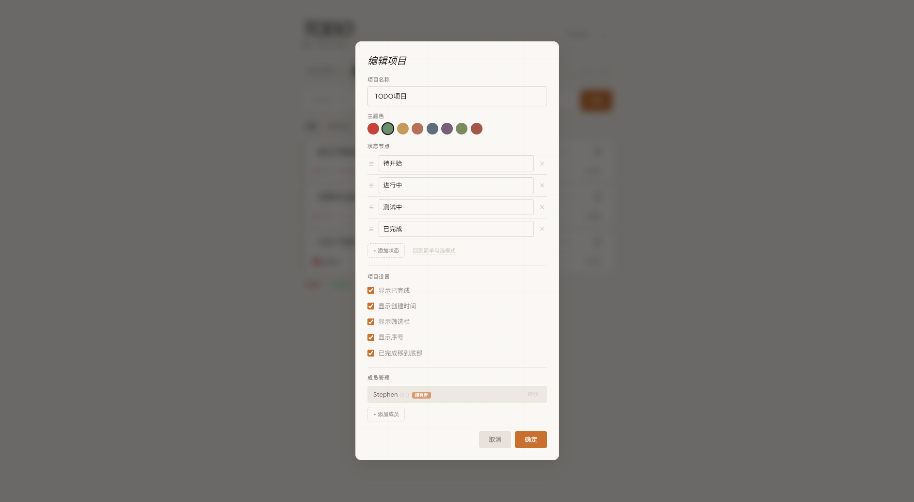
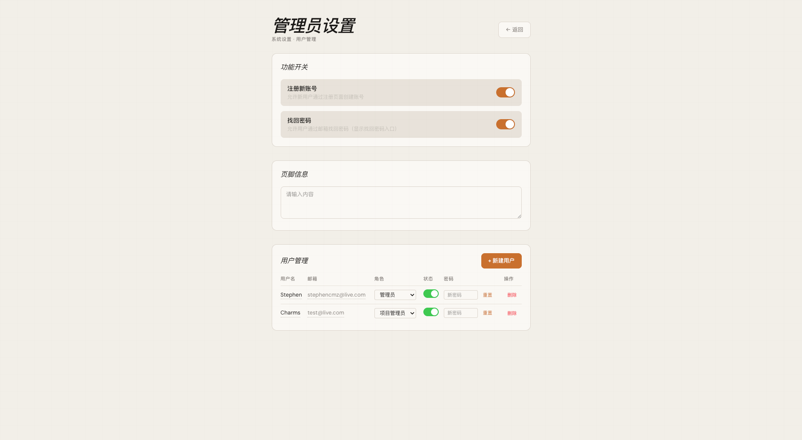

# TODO

> **极简任务管理，专注有序推进。**

一套克制而完备的项目任务管理系统，去掉冗余干扰，只保留真正必要的功能：多项目管理、自定义状态流程、用户协作、管理员面板。






---

## 功能特性

### 项目管理

- **多项目支持** — 自由创建多个项目，每个项目独立管理任务
- **颜色标识** — 每个项目可设置主题色，视觉区分一目了然
- **自定义状态节点** — 支持自定义工作流状态（如：待开始 → 进行中 → 审核中 → 已完成），也可使用简单的勾选模式
- **项目设置** — 可控制是否显示已完成任务、创建时间、筛选栏、序号，以及自动排序等
- **项目成员** — 支持添加成员并分配角色（管理/编辑/查看），实现协作管理
- **所有权转让** — 管理员可将项目拥有权转让给其他用户

### 任务管理

- **快速添加** — 输入框一键添加新任务
- **编辑与删除** — 支持行内编辑任务内容和删除任务
- **状态流转** — 在多节点模式下，点击状态节点流转任务进度
- **拖拽排序** — 支持拖拽调整任务顺序
- **状态筛选** — 按任务状态筛选显示
- **批量清理** — 一键清除已完成的任务

### 用户系统

- **注册与登录** — 支持用户名/邮箱和密码登录
- **密码找回** — 通过邮箱重置密码（可开关）
- **角色体系** — 管理员 / 项目管理员 / 普通用户
- **会话管理** — JWT 身份认证，Token 存储于本地

### 管理面板

- **功能开关** — 控制注册和密码找回功能的开启/关闭
- **用户管理** — 查看、创建、删除用户，修改角色，启用/禁用账户，重置密码
- **页脚信息** — 自定义页面底部展示内容（支持 HTML）

### 其他特性

- **深色模式** — 支持亮色/深色主题切换
- **响应式设计** — 适配桌面和移动设备
- **数据库加密** — 支持对任务内容进行 AES-256-GCM 加密
- **平滑动画** — 精致的微交互动画提升使用体验
- **Docker 部署** — 提供 Dockerfile 和 docker-compose.yml 一键部署

---

## 技术栈

| 层级         | 技术                                        |
| ------------ | ------------------------------------------- |
| **前端**     | React 19, TypeScript, Vite 8, TailwindCSS 4 |
| **后端**     | Express 5, TypeScript (tsx)                 |
| **数据库**   | SQLite (better-sqlite3)                     |
| **认证**     | JWT (jsonwebtoken), bcryptjs                |
| **容器化**   | Docker, node:22-alpine                      |
| **代码检查** | oxlint                                      |
| **字体**     | Playfair Display (标题), DM Sans (正文)     |

---

## 快速开始

### 开发模式

```bash
# 安装依赖
npm install

# 同时启动前端开发服务器和后端 API 服务器
npm run dev:all

# 或分别启动：
npm run dev     # 前端 (Vite，端口 5173)
npm run server  # 后端 (Express，端口 3001)
```

Vite 配置了 API 代理，前端请求 `/api/*` 会自动转发到后端。

### 生产构建

```bash
npm run build
npm start
```

### Docker 部署

```bash
# 构建并启动
docker compose up -d

# 可选：设置数据库加密密码
DB_PASSWORD=your-secret-password docker compose up -d
```

服务默认监听 `3001` 端口。

---

## 项目结构

```
├── src/                      # 前端源代码
│   ├── components/           # React 组件
│   │   ├── AddTodo.tsx       # 添加任务
│   │   ├── AdminPanel.tsx    # 管理员面板
│   │   ├── ConfirmModal.tsx  # 确认对话框
│   │   ├── FilterBar.tsx     # 状态筛选栏
│   │   ├── Footer.tsx        # 任务统计页脚
│   │   ├── FooterBanner.tsx  # 自定义页脚横幅
│   │   ├── ForgotPasswordPage.tsx
│   │   ├── Header.tsx        # 页面头部
│   │   ├── LoginPage.tsx     # 登录页
│   │   ├── ModalOverlay.tsx  # 模态框遮罩
│   │   ├── ProjectBar.tsx    # 项目切换栏
│   │   ├── ProjectModal.tsx  # 项目编辑/新建弹窗
│   │   ├── RegisterPage.tsx  # 注册页
│   │   ├── ResetPasswordPage.tsx
│   │   ├── StatusBar.tsx     # 任务状态节点
│   │   ├── ThemeToggle.tsx   # 主题切换
│   │   ├── TodoItem.tsx      # 任务条目
│   │   ├── TodoList.tsx      # 任务列表
│   │   └── UserMenu.tsx      # 用户菜单
│   ├── hooks/
│   │   └── useTheme.ts       # 主题 Hook
│   ├── store/
│   │   ├── authStore.tsx     # 认证状态管理
│   │   └── todoStore.tsx     # 任务/项目状态管理
│   ├── types/
│   │   ├── index.ts          # 项目/任务类型定义
│   │   └── user.ts           # 用户类型定义
│   ├── utils/
│   │   ├── colors.ts         # 颜色工具
│   │   └── helpers.ts        # 通用工具函数
│   ├── App.tsx               # 应用主组件
│   ├── index.css             # 全局样式与主题变量
│   └── main.tsx              # 入口文件
├── server/src/               # 后端源代码
│   ├── index.ts              # 服务器入口
│   ├── auth.ts               # 认证中间件 (JWT, bcrypt)
│   ├── db.ts                 # 数据库操作 (SQLite)
│   ├── encryption.ts         # 数据库加密 (AES-256-GCM)
│   ├── routes.ts             # 项目/任务 API 路由
│   ├── routes-admin.ts       # 管理员 API 路由
│   └── routes-auth.ts        # 认证 API 路由
├── data/                     # SQLite 数据库文件
├── images/                   # 截图
├── public/
│   ├── favicon.svg
│   └── icons.svg
├── dist/                     # 构建输出
├── Dockerfile                # Docker 构建文件
├── docker-compose.yml        # Docker Compose 配置
└── vite.config.ts            # Vite 配置
```

---

## 权限体系

### 用户角色

| 角色              | 权限                           |
| ----------------- | ------------------------------ |
| **admin**         | 系统管理员，全部权限           |
| **project_admin** | 项目管理员，可创建和管理项目   |
| **user**          | 普通用户，基于成员权限访问项目 |

### 项目成员角色

| 角色       | 权限                     |
| ---------- | ------------------------ |
| **manage** | 管理项目设置、成员、任务 |
| **edit**   | 添加、编辑、删除任务     |
| **view**   | 查看项目和任务（只读）   |

---

## 环境变量

| 变量          | 说明                   | 默认值           |
| ------------- | ---------------------- | ---------------- |
| `PORT`        | 服务器端口             | `3001`           |
| `DB_PATH`     | 数据库文件路径         | `./data/todo.db` |
| `DB_PASSWORD` | 数据库加密密码（可选） | 空（不加密）     |
| `JWT_SECRET`  | JWT 签名密钥           | 内置开发密钥     |

> **安全提示**：生产环境请务必设置 `JWT_SECRET` 和 `DB_PASSWORD` 环境变量。

---

## License

MIT
